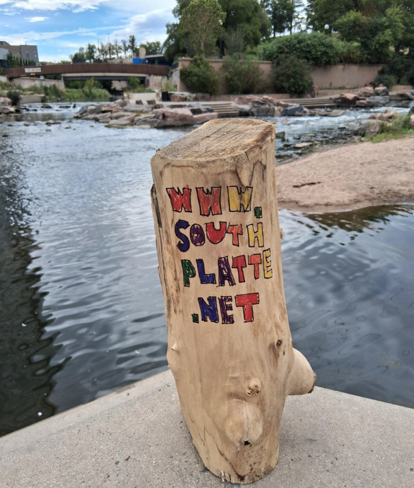
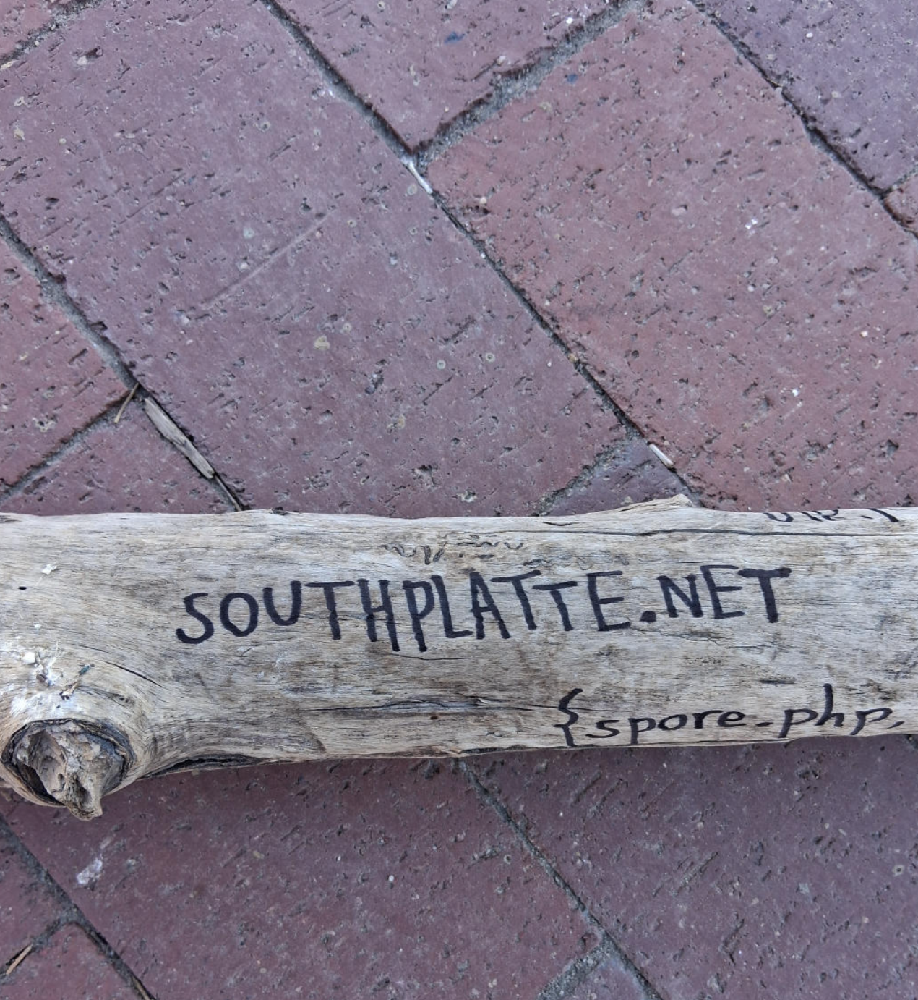
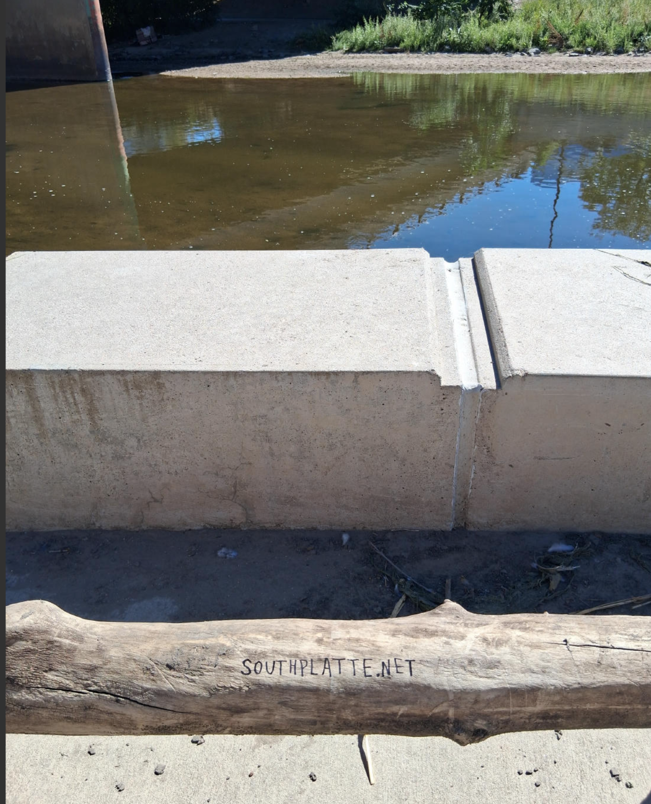
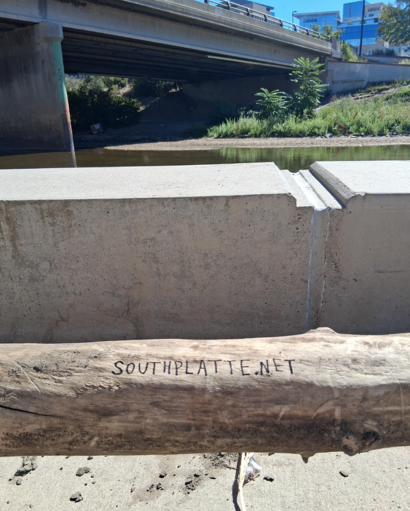
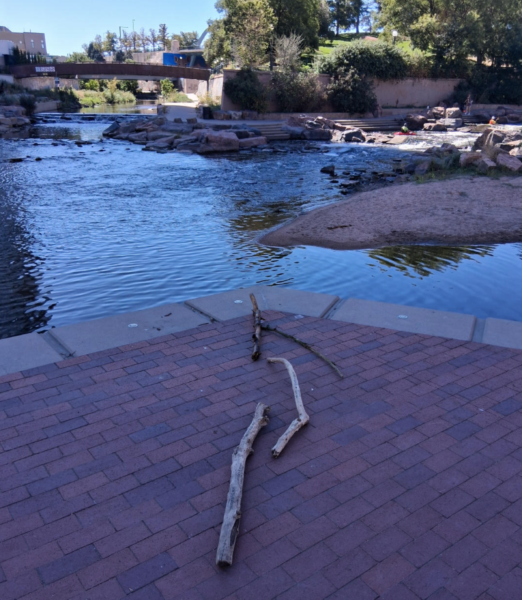
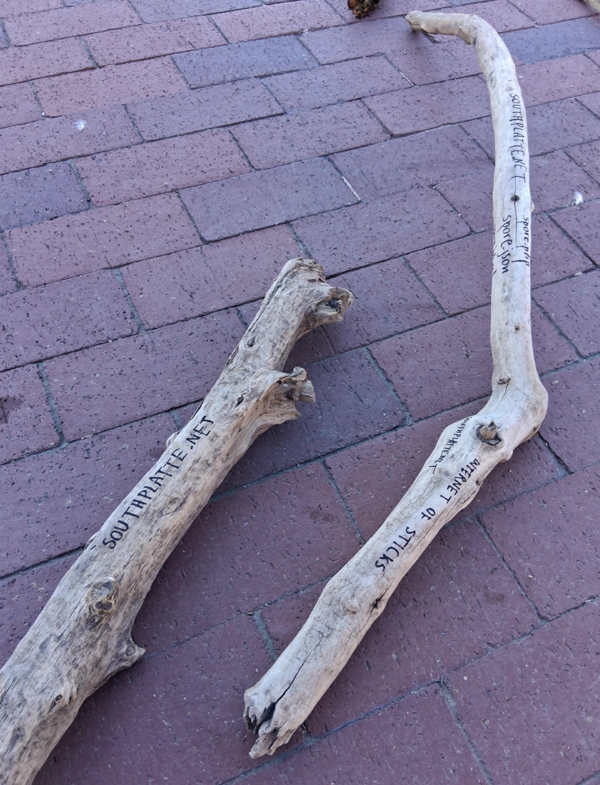
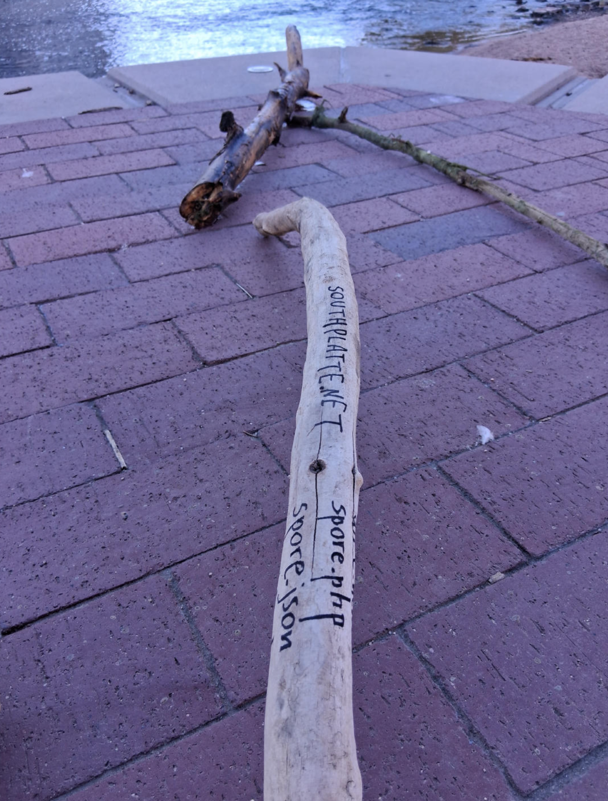
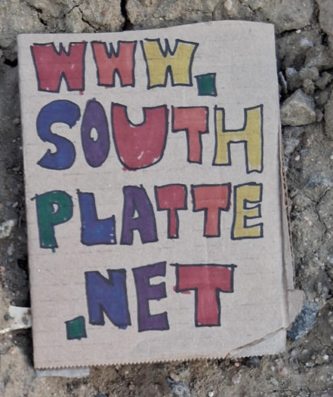

# [Internet of Sticks](https://github.com/LafeLabs/southplatte.net)

*WRITE THE DOMAIN ON A STICK AND BRING THE STICK TO THE RIVER!*

*INTERNET OF STICKS!*

*THE MEDIUM IS THE MESSAGE!*

*THE MEDIUM IS DRIFT WOOD AND MARKER AND PAINT PEN!*

*THE PLATFORM IS THE GLOBAL NETWORK OF RIVERS AND STREAMS AND HIGHWAYS!*

*SELF REPLICATING HTML!*

*BECOME THE FUNGUS!*

[](https://www.openstreetmap.org/#map=19/39.754728/-105.008223)

[](https://www.openstreetmap.org/#map=19/39.754728/-105.008223)

[](https://www.openstreetmap.org/#map=19/39.754728/-105.008223)

[](https://www.openstreetmap.org/#map=19/39.754728/-105.008223)

[](https://www.openstreetmap.org/#map=19/39.754728/-105.008223)

[](https://www.openstreetmap.org/#map=19/39.754728/-105.008223)

[](https://www.openstreetmap.org/#map=19/39.754728/-105.008223)

[](https://www.openstreetmap.org/#map=19/39.754728/-105.008223)


## Media Stack

 - [spore.php](https://github.com/LafeLabs/spore/blob/main/spore.php)
 - [spore.json](https://github.com/LafeLabs/spore/blob/main/spore.json)
 - [spore.html](https://github.com/LafeLabs/spore/blob/main/spore.html)
 - [index.html](https://github.com/LafeLabs/spore/blob/main/index.html)
 - [branch.html](https://github.com/LafeLabs/spore/blob/main/branch.html)
 - [wall.txt](https://github.com/LafeLabs/spore/blob/main/wall.txt)
 - [load-file.php](https://github.com/LafeLabs/spore/blob/main/load-file.php)
 - [save-file.php](https://github.com/LafeLabs/spore/blob/main/save-file.php)
 - [delete-file.php](https://github.com/LafeLabs/spore/blob/main/delete-file.php)
 - [create-branch.php](https://github.com/LafeLabs/spore/blob/main/create-branch.php)
 - [delete-branch.php](https://github.com/LafeLabs/spore/blob/main/delete-branch.php)
 - [editor.html](https://github.com/LafeLabs/spore/blob/main/editor.html)
 - [ace.js](https://ace.c9.io/)
 - [showdown.js](https://github.com/showdownjs/showdown)
 - [p5js](https://p5js.org/)
 - [html](https://en.wikipedia.org/wiki/HTML)
 - [javascript](https://en.wikipedia.org/wiki/JavaScript)
 - [css](https://en.wikipedia.org/wiki/CSS)
 - [php](https://en.wikipedia.org/wiki/PHP)
 - [json](https://en.wikipedia.org/wiki/JSON)
 - [markdown](https://en.wikipedia.org/wiki/Markdown)
 - [http](https://en.wikipedia.org/wiki/HTTP)
 - [apache](https://en.wikipedia.org/wiki/Apache_HTTP_Server)
 - [linux](https://en.wikipedia.org/wiki/Linux)
 - [digital ocean](https://www.digitalocean.com/)
 - [porkbun](https://porkbun.com/)
 - [stick](https://github.com/LafeLabs/southplatte.net/raw/main/stick-feed.png)
 - [cardboard sign](https://github.com/LafeLabs/southplatte.net/raw/main/cardboard-sign1.png)
 - [river](https://www.openstreetmap.org/#map=19/39.754728/-105.008223)
 - [highway](https://www.openstreetmap.org/#map=16/39.71923/-105.00756)
 - [python](https://en.wikipedia.org/wiki/Python_(programming_language))
 - [dirt.py](https://github.com/LafeLabs/dirt/blob/main/dirt.py)
 - [dirtspore.py](https://github.com/LafeLabs/dirt/blob/main/dirtspore.py)
 - [dirt.js](https://github.com/LafeLabs/dirt/blob/main/dirt.js)
 - [dirt.html](https://github.com/LafeLabs/dirt/blob/main/dirt.html)
 - [wifi](https://en.wikipedia.org/wiki/Wi-Fi)
 - [bus](https://www.rtd-denver.com/)
 - [bike](https://en.wikipedia.org/wiki/Bicycle)
 - [black flag](https://github.com/LafeLabs/spore/blob/main/black-flag-3.png)


# [southplatte.net](https://southplatte.net)

# [localhost/southplatte.net/readme.html](http://localhost/southplatte.net/readme.html)

# [spore](https://github.com/LafeLabs/spore/)

```
sudo curl -o spore.php https://raw.githubusercontent.com/LafeLabs/southplatte.net/refs/heads/main/spore.php
php spore.php
 ```
 
## Watershed network

Sticks with writing on rivers.

## Live Web Pages

 - [https://metaspore.net/](https://metaspore.net/)
 - [https://trashrobot.net/](https://trashrobot.net/)
 - [https://trashrobot.org/](https://trashrobot.org/)
 - [https://aerostatpark.net/](https://aerostatpark.net/)
 - [https://composttheology.net/](https://composttheology.net/)
 - [https://soiltheology.net/](https://soiltheology.net/)
 - [https://southplatte.net](https://southplatte.net)
 - [https://basemar.lol/](https://basemar.lol/)
 - [https://unionstation.lol/](https://unionstation.lol/)
 - [https://skoolie.lol/](https://skoolie.lol/)
 - [https://schoolie.lol](https://schoolie.lol)
 - [https://sprintervan.lol](https://sprintervan.lol)
 - [https://quantumnoise.org/](https://quantumnoise.org/)
 - [https://magicspore.net/](https://magicspore.net/)
 - [https://denverbus.net](https://denverbus.net)


## Replication Path:

 - [buy a domain](https://porkbun.com/) or get a subdomain from someone for your local trash  magic universe
 - get a [digital ocean](https://www.digitalocean.com/) account and set up a droplet, get droplet ip address
 - add an A record for @ and point to the droplet
 - add an A record for www and point to the droplet
 - ssh root@[ip address of droplet] (use PowerShell if in Windows)
 - ```sudo apt update```
 - ```sudo apt install apache2 -y```
 - ```sudo apt install php libapache2-mod-php -y```
 - ```mkdir -p /var/www/[DOMAIN]/public_html```
 - ```cd /var/www/[DOMAIN]/public_html```
 - ```sudo curl -o spore.php https://raw.githubusercontent.com/LafeLabs/spore/refs/heads/main/spore.php```
 - ```php spore.php```
 - ```cd /etc/apache2/sites-available/```
 - ```sudo curl -o template.conf https://raw.githubusercontent.com/LafeLabs/spore/refs/heads/main/template.conf.txt```
 - ```cp template.conf [DOMAIN].conf```
 - ```sed -i "s/TEMPLATE_DOMAIN/[DOMAIN]/g" [DOMAIN].conf```
 - ```a2ensite [DOMAIN].conf```
 - ```systemctl restart apache2```
 - ```certbot --apache -d [DOMAIN]```
 - ```chown -R www-data:www-data /var/www/[DOMAIN]/public_html```


