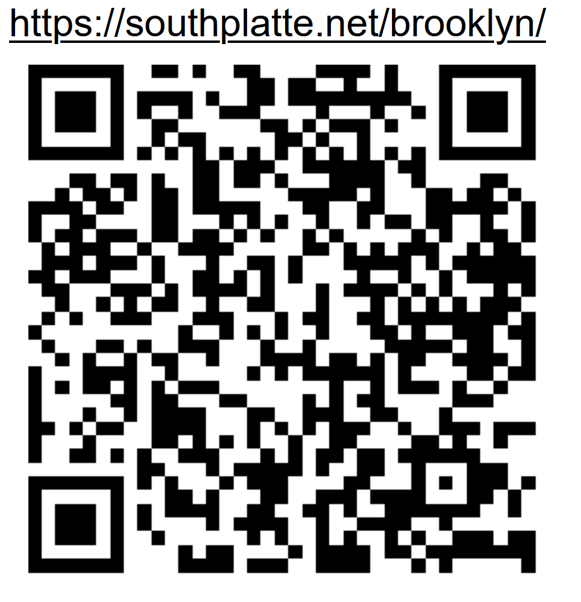
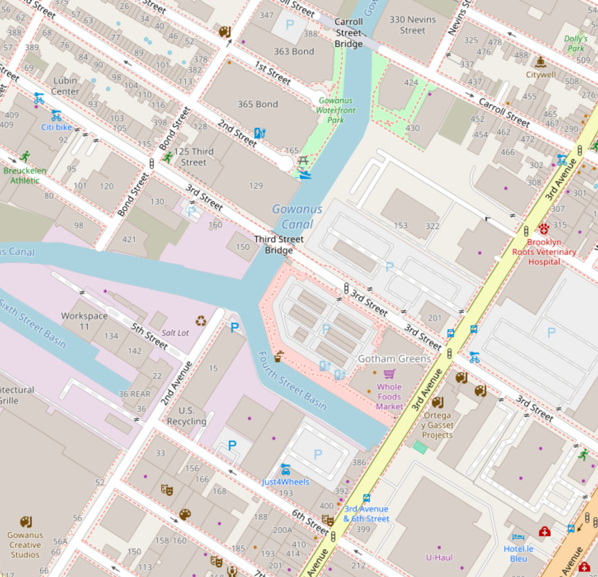

*Write the url on the stick*

*and put the stick at the node!*

# [Internet of Sticks](https://github.com/LafeLabs/southplatte.net)

# [southplatte.net/brooklyn/](https://southplatte.net/brooklyn)

# [Brooklyn](https://www.openstreetmap.org/#map=17/40.675516/-73.990442)

[](https://www.openstreetmap.org/#map=17/40.675516/-73.990442)

# stick.json

```
{
  "name":"internet-of-sticks",
  "description":"stick with www.southplatte.net written on it at the node",
  "operator":"https://wurrm.com/",
  "wall":"https://southplatte.net/brooklyn/",
  "spore":"https://github.com/lafelabs/southplatte.net",
  "node":"https://www.openstreetmap.org/#map=17/40.675516/-73.990442",
  "mission":"self replicating stick feed at the node"
}
```