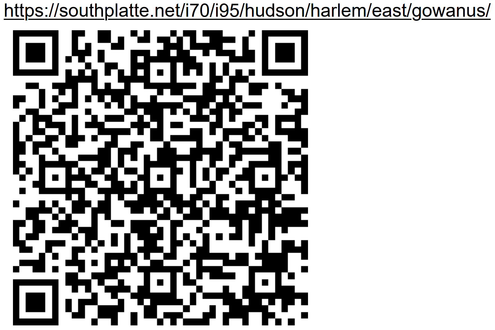

# [Internet of Sticks](https://github.com/LafeLabs/southplatte.net)

# [map](https://www.openstreetmap.org/#map=17/40.676282/-73.990538)
# [live instance](https://southplatte.net/i70/i95/hudson/harlem/east/gowanus/)

 - [southplatte river/](https://southplatte.net/)
 - [interstate 70/](https://southplatte.net/i70/)
 - [interstate 95/](https://southplatte.net/i70/i95/)
 - [hudson river/](https://southplatte.net/i70/i95/hudson/)
 - [harlem river/](https://southplatte.net/i70/i95/hudson/harlem/)
 - [east river/](https://southplatte.net/i70/i95/hudson/harlem/east/)
 - [gowanus canal/](https://southplatte.net/i70/i95/hudson/harlem/east/gowanus/)

## [edit this file locally](http://localhost/southplatte.net/i70/i95/hudson/harlem/east/gowanus/readme.html)